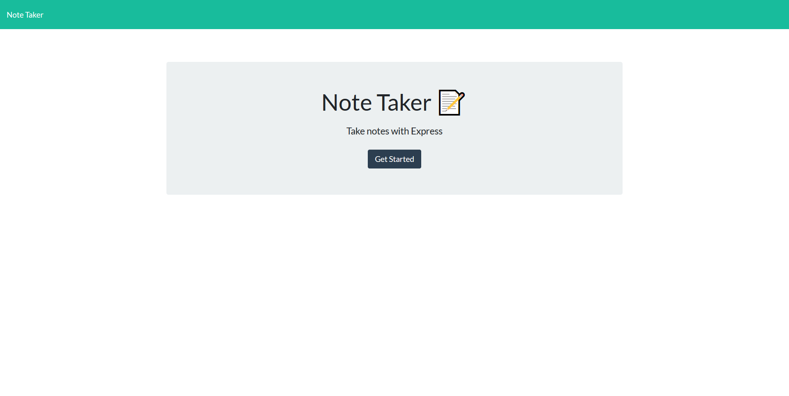

# Note Taker

<!--
add screenshot to directory if desired

-->

[Visit Website](https://obscure-hollows-78184.herokuapp.com/)

## Description

A web application that allows the user to create and save notes

## Table of Contents
  * [Installation](#installation)
  * [Usage](#usage)
  * [License](#license)
  * [Contribution](#contribution)
  * [Testing](#testing)
  * [Questions](#questions)
  
## Installation
Clone project into a local directory and cd into note-taker directory. Run npm install, then once all packages have been installed, run npm start, and verify server start message in console. Navigate to port 3001 of your localhost to use application locally.

## Usage
Add note Title and body, then click the save icon to save the note. Click past notes in left sidebar to display them to the right in the main content area. Click the trash icon to delete old notes.

## License
This project is covered under the MIT license

## Contribution
To see how you can contribute to this project see the [Contributor Covenant](https://www.contributor-covenant.org/)

## Testing
No tests currently

## Questions
Link to my GitHub
[Joey-Ramos](https://github.com/Joey-Ramos)

If you have any questions or would like to contact me, please email me at
[jramos1202@gmail.com](mailto:jramos1202@gmail.com)
